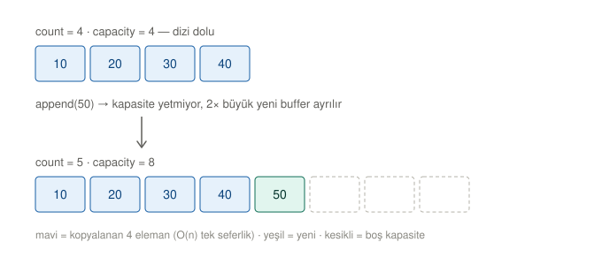

# Array

> **Tam deep-dive:** `DSA.playground/Pages/01-Array.xcplaygroundpage/Contents.swift`
> Bu dosya hızlı referans özetidir. Playground'da çalıştırılabilir örnekler bulunur.

## TL;DR

Array = contiguous memory bloğu. `base + offset` aritmetiği ile O(1) random access sağlar.
Swift `Array` bir value type'tır; reference-counted heap buffer üzerinde Copy-on-Write ile çalışır.

## Şema — dinamik dizi büyümesi (amortized O(1) append)

Dolu buffer'a `append`: kapasite yetmez → 2× büyük yeni buffer ayrılır → 4 eleman kopyalanır (**O(n) tek seferlik**) → yeni eleman eklenir. Bu kopyalama nadir olduğu ve maliyeti sonraki n append'e yayıldığı için **amortized O(1)**. Ezberleme — şemayı gözünde canlandır, sayıyı türet.

## Mekanik (Under the Hood) — türet, ezberleme

Adres = sadece bir sayı; bellek (RAM) dev bir byte dizisidir, adres o dizideki index'tir. Örn. `0x100 = 256` (onluk); byte #256.

- **Access `arr[i]` → O(1):** `adres(arr[i]) = base + i × stride` (`stride` = elemanın byte boyutu; `MemoryLayout<Int>.stride == 8`). Örn. `arr[3] = 0x100 + 3×8 = 0x118 = 280`. Tek çarpma+toplama, doğrudan zıplar, taramaz → `i` ne olursa olsun sabit. `arr[0]` ile `arr[999999]` **aynı** maliyet.
- **Insert/remove (baş/orta) → O(n):** Bitişiklik korunmak zorunda (yoksa `base+i×stride` bozulur). Baştan/ortadan eklemek için sonraki **tüm** elemanlar bir slot **kaydırılır** → `n` kaydırma. Bu, dizi dolu olmasa bile olur. **Not:** insert'i O(n) yapan şey kaydırmadır, "yeni dizi" değil.
- **Append → O(1) amortized:** Boş kapasite varsa sona doğrudan yazılır (O(1)). Kapasite **doluysa** → **growth**: 2× büyük yeni blok ayrılır, hepsi kopyalanır (O(n) tek sefer). Kopyalar `1+2+4+…+n ≈ 2n` (geometric seri) olduğundan, `n` append'e yayılınca işlem başına sabit = **amortized O(1)**.
  - **Neden 2× kritik:** `+1` büyüseydi kopyalar `1+2+…+n = O(n²)` → append başı O(n). Geometric growth toplam kopyalamayı `2n`'de tutar.
  - **Shift ≠ Growth:** kaydırma (insert/remove) ile büyüme (dolunca kopyalama) ayrı kavramlar; ikisi de O(n) ama farklı sebep.

## Temel Invariant'lar

- Contiguity — tüm elemanlar tek bir memory bloğunda
- Homogeneity — aynı tip, aynı stride
- Bounds — `index ∈ [0, count)`, ihlalde Swift trap atar
- Capacity ≥ count — allocate edilen ≥ kullanılan

## Big O

| Operation | Average | Worst |
|-----------|---------|-------|
| `arr[i]` | O(1) | O(1) |
| `append` | O(1) amortized | O(n) realloc |
| `insert(at:)` | O(n) | O(n) |
| `remove(at:)` | O(n) | O(n) |
| `contains` | O(n) | O(n) |
| Binary search (sorted) | O(log n) | O(log n) |
| `sort()` | O(n log n) | O(n log n) |
| CoW copy | O(1) | O(n) ilk mutation'da |

## Swift'e Özgü

- `Array<T>` Obj-C bridging destekler; `ContiguousArray<T>` desteklemez (~2x daha hızlı iteration)
- `ArraySlice` parent buffer'ı tamamen retain eder — uzun yaşıyorsa **gizli memory leak**
- CoW, `isKnownUniquelyReferenced == false` olduğunda **mutation** anında tetiklenir, **assignment'ta değil**
- Geometric growth (~2x) amortized O(1) append verir; `reserveCapacity` resize storm'unu engeller

## Karar Motoru

✅ Kullan:
- Read-heavy + random access
- Boyutu bilinen / bounded
- Cache-sensitive hot path
- Iteration-dominated algoritmalar

❌ Kaçın:
- Sık mid-insert / mid-delete
- O(1) key lookup gerekiyor → `Dictionary`
- İki uçtan büyüyen FIFO/LIFO → `Deque`

## Senior Sinyalleri / Bilinmesi Gereken Terimler

- Amortized analysis (banker's / potential method)
- Spatial / temporal locality
- Cache line, prefetching
- Stride vs size vs alignment
- Geometric growth factor
- Copy-on-Write, `isKnownUniquelyReferenced`
- Pointer chasing (LinkedList kontrastı)

## Problem Merdiveni (pekiştirme yol haritası)

Sıra: her problem yeni bir Array pattern'i ekler; kolaydan zora. `[x]` = çözüldü.

| # | Problem | Zorluk | Öğrettiği pattern | Durum |
|---|---------|--------|-------------------|-------|
| 0283 | Move Zeroes | Easy | In-place write-pointer | [x] ✅ 2026-08-01 |
| 0026 | Remove Duplicates (Sorted) | Easy | Write-pointer (dedupe) | [ ] |
| 0121 | Best Time to Buy/Sell Stock | Easy | Tek-pass min takibi | [ ] |
| 0238 | Product of Array Except Self | Medium | Prefix/suffix çarpım | [ ] |
| 0053 | Maximum Subarray (Kadane) | Medium | Running-sum DP | [ ] |
| 0167 | Two Sum II (Sorted) | Medium | Converging two-pointer | [ ] |
| 0011 | Container With Most Water | Medium | Two-pointer (greedy) | [ ] |
| 0189 | Rotate Array | Medium | Reversal trick | [ ] |
| 0015 | 3Sum | Medium | Sort + two-pointer | [ ] |
| 0042 | Trapping Rain Water | Hard | Two-pointer / prefix-max | [ ] |

**Not:** Array mekaniği (O(1) erişim, O(n) shift, write-pointer) bu problemlerin **hepsinde** tekrar tekrar kullanılır — ayrıca String, Sliding Window, Matrix konularında da. Yani Array asla "bitmiş" bir konu değil; her yeni konuda yeniden pekişir (interleaving).
